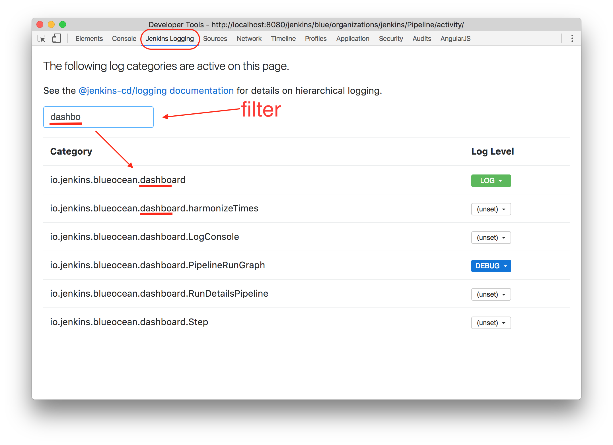

# jenkins-logging-chrome-ext

Google Chrome Developer Tools extension for the [@jenkins-cd/logging](https://www.npmjs.com/package/@jenkins-cd/logging) NPM package.

__To install__:

1. [Click here](https://github.com/tfennelly/jenkins-logging-chrome-ext/raw/master/chrome-extension.crx) to download the Extension file (`.crx` file).
1. Open your browser's Google Chrome Extensions page (Window -> Extensions menu).
1. Drag the `.crx` file (#1 above) onto your browser's Google Chrome Extensions page (#2 above).

Once installed, simply open the Developer Tools window from the View menu of the browser.

